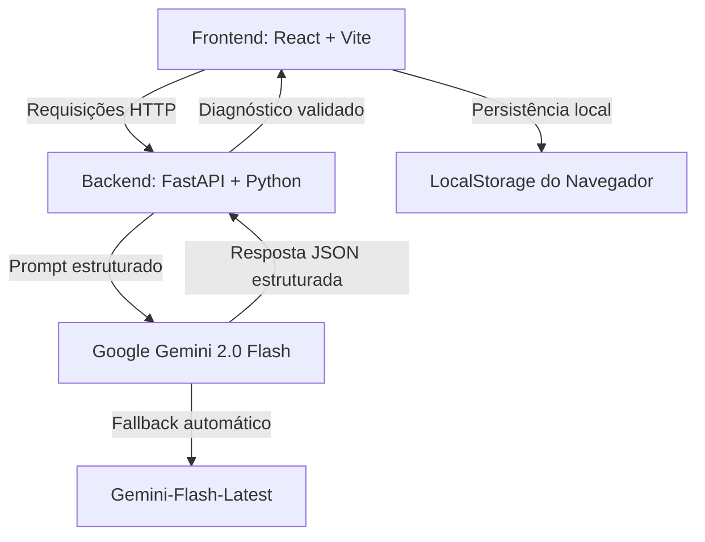

# ⚙️ SIMI — Sistema Inteligente de Manutenção Industrial  
### Análise de Falhas em Tempo Real com IA Generativa (Google Gemini 2.0 Flash)

O **SIMI** é uma plataforma avançada para otimização da manutenção industrial, utilizando **Inteligência Artificial Generativa** para transformar descrições técnicas de sintomas em **laudos estruturados em JSON**, permitindo tomada de decisão rápida, técnica e baseada em dados.

Este projeto representa o esforço técnico final da **Pós-Graduação em Inteligência Artificial**, com foco na redução de *downtime* fabril por meio de diagnósticos instantâneos contendo:

- 🔎 Causas prováveis  
- ⚠️ Nível de severidade  
- 🛠️ Plano de ação recomendado  

---

# 🏗️ 1. Arquitetura do Sistema

A aplicação segue uma arquitetura **desacoplada (Frontend / Backend)**, garantindo escalabilidade, modularidade e independência entre interface e API.

## 🔄 Fluxo de Comunicação (Data Flow)



---

# 📂 2. Estrutura do Projeto

Mapeamento fiel da estrutura visualizada no VS Code para garantir reprodutibilidade do ambiente:

```plaintext
MANUTENCAO-INDUSTRIAL-WEB/
│
├── .venv/                  
│   └── Ambiente virtual Python
│
├── backend/                
│   ├── main.py             
│   │   └── Core da API, endpoints e integração com SDK Gemini
│   ├── requirements.txt    
│   │   └── Dependências Python
│   ├── squarecloud.app     
│   │   └── Configuração de deploy (SquareCloud)
│   ├── .env.example        
│   │   └── Template de variáveis de ambiente
│   └── __pycache__/        
│
├── frontend/               
│   ├── src/
│   │   ├── App.jsx         
│   │   │   └── Lógica do dashboard + integração com API + LocalStorage
│   │   ├── main.jsx        
│   │   │   └── Entry point React
│   │   └── styles.css      
│   │       └── Tema visual industrial
│   │
│   ├── package.json        
│   │   └── Dependências Node.js
│   ├── vite.config.js      
│   │   └── Configuração do bundler Vite
│   └── .env.example        
│       └── Variáveis de ambiente para conexão com API
|── prompts               
|    └── system_prompt.txt
|
|── tools               
|    └── explicação.txt
│
└── README.md               
    └── Documentação técnica
```

---

# 🛠️ 3. Stack Tecnológica

## 🔤 Linguagens
- Python 3.10+
- JavaScript (React)

## 🤖 Inteligência Artificial
- **Google Gemini 2.0 Flash** (Modelo principal)
- **Gemini-Flash-Latest** (Fallback automático para resiliência de cota)

## ⚙️ Configuração do modelo
- Configuramos a Temperatura em 0.2 para garantir respostas técnicas determinísticas e precisas, essenciais para diagnósticos industriais, evitando a criatividade (alucinação) do modelo.

## ⚙️ Justificativa de modelo pago vs.Local
- Escolhi o Gemini 2.0 Flash pela sua capacidade superior de Structured Output (JSON) e latência reduzida comparada a modelos locais, o que é crítico para um ambiente de fábrica.

## ⚙️ Backend
- FastAPI
- Uvicorn (execução assíncrona)
- Integração via SDK Gemini

## 🎨 Frontend
- React.js
- Vite (build rápido e dev server)

## ☁️ Hospedagem
- Backend: SquareCloud
- Frontend: Vercel

---

# 🚧 4. Desafios Técnicos e Soluções

O histórico extenso de commits reflete um processo iterativo de engenharia e refinamento.

## 🔁 Rate Limiting (Erro 429)

**Problema:**  
Limite de requisições por minuto da API gratuita do Gemini.

**Solução Implementada:**  
- Lógica de fallback dinâmico entre modelos  
- Alternância automática para garantir entrega contínua do diagnóstico  

---

## 💾 Persistência de Dados

**Problema:**  
Evitar custo e latência de banco de dados externo nesta fase do projeto.

**Solução:**  
- Utilização de `LocalStorage`
- Histórico de diagnósticos mantido no navegador
- Gráficos persistem durante a sessão

---

## 🧠 Engenharia de Prompt

**Problema:**  
A IA retornava textos fora do padrão esperado.

**Solução:**  
 Refinamento iterativo de prompt
- Obrigatoriedade de retorno em JSON estruturado
- Validação de severidade e campos obrigatórios

**Estratégia de Prompting:**  
- Utilizamos a técnica de Chain-of-Thought embutida no System Prompt para forçar o modelo a raciocinar sobre os sintomas antes de classificar a severidade, além de XML tags para delimitar contextos".

**O que Não Funcionou:** 
- Durante os testes, o modelo ocasionalmente falhava em retornar um JSON válido se o input fosse muito curto; resolvemos isso adicionando Few-Shot examples no prompt para padronizar o output".

**Decisões de Engenharia de Prompt:** 
- Persona: Definida como Engenheiro Sênior para elevar o vocabulário técnico da LLM.
- Restrição de Saída (Structured Output): Uso de JSON para garantir integração direta com o dashboard React.
- Otimização de Latência: Transição de parágrafos longos para bullet points no summary para reduzir o tempo de geração e evitar timeouts na    Square Cloud.
- Query ID: Inclusão de um timestamp dinâmico no backend para evitar que o modelo utilize contextos de consultas anteriores (cache de resposta)

---

# 📊 5. Funcionalidades de BI e Dashboard

O sistema entrega uma camada analítica estratégica com indicadores dinâmicos:

## 📌 Indicadores

### 🥧 Distribuição de Severidade
Gráfico de pizza demonstrando:
- Baixa
- Média
- Alta criticidade

### 📊 Volume por Equipamento
Gráfico de barras horizontais exibindo:
- Máquinas com maior recorrência de falhas

### 🔢 Contador Global
- Total de diagnósticos realizados na sessão ativa

---

# 💻 6. Guia de Instalação e Execução

## 🔹 Passo 1 — Backend

```bash
cd backend

python -m venv .venv

# Linux / Mac
source .venv/bin/activate

# Windows
.venv\Scripts\activate

pip install -r requirements.txt

# Criar arquivo .env e adicionar:
# GEMINI_API_KEY=sua_chave_aqui

python main.py
```

O servidor FastAPI iniciará localmente.

---

## 🔹 Passo 2 — Frontend

```bash
cd frontend

npm install
npm run dev
```

O Vite iniciará o servidor de desenvolvimento.

---

# 📈 7. Objetivo Estratégico

Reduzir o tempo de indisponibilidade industrial (*downtime*) por meio de:

- Diagnóstico instantâneo assistido por IA  
- Padronização técnica de laudos  
- Apoio à tomada de decisão operacional  

---

# 👨‍💻 Autor

**Julio Cesar Lumke**  
Projeto Final — IA Generativa 

---

> Sistema desenvolvido com foco em eficiência operacional, engenharia de IA aplicada e arquitetura moderna desacoplada.